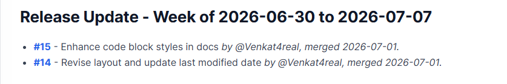
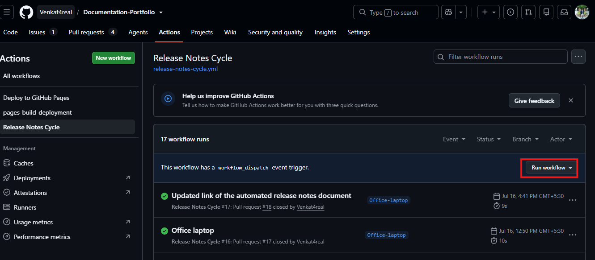

## GitHub Actions Workflow: Release Notes Automation

The source files for the automated release notes are located at:

#### YAML file

Repo → .github → workflows → release-notes-cycle.yml

#### JavaScript

Repo → .github → scripts → update-release-notes.js

This workflow automatically updates the repository's release notes file. It coordinates with the Node.js script.

### Triggers

The workflow runs in three scenarios:

- PR Merge — When a pull request is merged to main
- Weekly Schedule — Every Tuesday at 9:00 AM UTC
- Manual Trigger — Via workflow_dispatch (run it manually from the Actions tab)

What It Does

Step 1: Checkout Code
Clones the repository's main branch with full history.

Step 2: Setup Node.js
Installs Node.js v24.
Enables npm caching for faster builds.

Step 3: Run the Update Script
If a PR is merged, runs in PR mode and adds the PR to the release notes.
If scheduled or manually triggered, runs in weekly mode, archives the week's PRs in a dated section, and resets the auto-section.

Step 4: Commit and Push
Configures Git as the GitHub Actions bot.
Stages the updated docs/release_notes.md.
Commits with a message such as `docs: auto-update release notes for pull_request cycle`.
Pushes the changes back to main.
(Silently skips the step if no changes occur.)

The Flow
PR Merged → workflow triggers → adds entry to auto-section → commits & pushes

Tuesday 9 AM → weekly mode triggers → rotates auto-section into dated entry → commits & pushes

Collects all PRs accumulated in the auto-section over the past week
Archives them into a dated section like "Release Update - Week of 2024-01-15 to 2024-01-22"
Resets the auto-section back to empty

- Manual Trigger — Via workflow_dispatch (run it manually from the Actions tab)

Additionally, Users can manually tigger the automation from the Github. This screen can be accessed from the path:
Reposistory -> Actions -> All Work flows -> Release Notes Cycle -> Run Workflow

The Flow

PR Merged → workflow triggers → adds entry to auto-section → commits & pushes

- Collects all PRs accumulated in the auto-section over the past week
- Archives them into a dated section like "Release Update - Week of 2024-01-15 to 2024-01-22"
- Resets the auto-section back to empty
