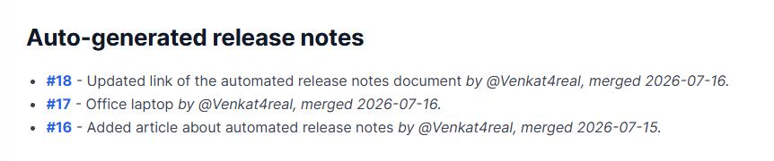

## GitHub Actions Workflow: Release Notes Automation

The source file for the automated release notes is in path:

#### YML file

Repo → .github → workflows → release-notes-cycle.yml

#### Java Script

Repo → .github → scripts → update-release-notes.js

### Triggers

The workflow runs in three scenarios:

- PR Merge — When a pull request is merged to main

Reads the GitHub event payload to extract PR details (number, title, author, merge date)
Formats the PR as a markdown entry with a link
Inserts it into the "Auto-generated release notes" section
Skips duplicates

The commit message will be displayed in the release notes, witht the (number, title, author, merge date).

- Weekly Schedule — Every Tuesday at 9:00 AM UTC

Collects all PRs accumulated in the auto-section over the past week
Archives them into a dated section like "Release Update - Week of 2024-01-15 to 2024-01-22"
Resets the auto-section back to empty

- Manual Trigger — Via workflow_dispatch (run it manually from the Actions tab)

Additionally, Users can manually tigger the automation from the Github. This screen can be accessed from the path:
Reposistory -> Actions -> All Work flows -> Release Notes Cycle -> Run Workflow

The Flow

PR Merged → workflow triggers → adds entry to auto-section → commits & pushes

Tuesday 9 AM → weekly mode triggers → rotates auto-section into dated entry → commits & pushes
