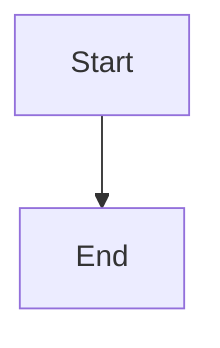

# 🧜‍♀️ Mermaid Diagrams in GitHub Pages — User Guide

> A comprehensive guide to using Mermaid diagrams in your GitHub Pages portfolio site.

---

## Table of Contents

1. [What is Mermaid?](#what-is-mermaid)
2. [Prerequisites](#prerequisites)
3. [Installing Dependencies](#installing-dependencies)
4. [Installing Mermaid](#installing-mermaid)
5. [Configuring Mermaid](#configuring-mermaid)
6. [Creating Your First Mermaid Diagram](#creating-your-first-mermaid-diagram)
7. [Diagram Types Reference](#diagram-types-reference)
8. [Best Practices](#best-practices)
9. [FAQs](#faqs)

---

## What is Mermaid?

[Mermaid](https://mermaid.js.org/) is a JavaScript-based diagramming and charting tool that renders Markdown-inspired text definitions into diagrams dynamically in the browser. It allows you to create flowcharts, sequence diagrams, Gantt charts, class diagrams, and more — all using simple, human-readable text syntax.

Place holder for SS

### Why Use Mermaid?

- **Text-based**: Diagrams are defined in plain text, making them easy to version-control with Git.
- **No external tools needed**: No need for Visio, Draw.io, or image editors — diagrams live alongside your code.
- **Dynamic rendering**: Diagrams are rendered client-side in the browser, so they're always up to date.
- **Wide support**: Natively supported in GitHub Markdown, GitLab, Notion, Confluence, and many other platforms.
- **Lightweight**: No heavy dependencies — just a single JavaScript library.

---

## Prerequisites

Before you begin, ensure you have the following installed on your machine:

| Tool | Minimum Version | Purpose |
|------|----------------|---------|
| [Node.js](https://nodejs.org/) | v16+ | JavaScript runtime |
| [npm](https://www.npmjs.com/) | v8+ | Package manager (bundled with Node.js) |
| [Git](https://git-scm.com/) | v2.30+ | Version control |
| A code editor | — | VS Code recommended |

### Verify installations

```bash
node --version
# Expected output: v16.x.x or higher

npm --version
# Expected output: 8.x.x or higher

git --version
# Expected output: git version 2.30.x or higher
```

---

## Installing Dependencies

### Step 1: Initialize your GitHub Pages project

If you don't already have a GitHub Pages site, create one:

```bash
# Create a new directory for your portfolio
mkdir my-portfolio
cd my-portfolio

# Initialize a Git repository
git init

# Initialize a Node.js project
npm init -y
```

### Step 2: Install a static site generator (optional but recommended)

If you're using a static site generator like Jekyll (GitHub Pages default) or Hugo, install it first.

**For Jekyll (Ruby-based — GitHub Pages default):**

```bash
# Install Ruby (if not already installed)
# macOS:
brew install ruby

# Ubuntu/Debian:
sudo apt-get install ruby-full

# Install Jekyll and Bundler
gem install jekyll bundler

# Create a new Jekyll site
jekyll new my-portfolio
cd my-portfolio
```

**For a plain HTML/JS site (no static site generator):**

```bash
# Create basic project structure
mkdir -p assets/js assets/css
touch index.html
```

### Step 3: Install a local development server

```bash
# Option A: Using npm
npm install --save-dev live-server

# Option B: Using Python (if available)
# python3 -m http.server 8000
```

---

## Installing Mermaid

There are multiple ways to add Mermaid to your GitHub Pages site. Choose the method that best fits your setup.

### Method 1: CDN (Simplest — Recommended)

Add the Mermaid script directly to your HTML file via a CDN. No npm install required.

```html
<!-- Add this in the <head> or before the closing </body> tag -->
<script type="module">
  import mermaid from 'https://cdn.jsdelivr.net/npm/mermaid@11/dist/mermaid.esm.min.mjs';
  mermaid.initialize({ startOnLoad: true });
</script>
```

### Method 2: npm install (For Node.js-based projects)

```bash
# Install Mermaid as a dependency
npm install mermaid

# Or as a dev dependency
npm install --save-dev mermaid
```

Then import it in your JavaScript:

```javascript
// ES Module
import mermaid from 'mermaid';

// CommonJS
const mermaid = require('mermaid');
```

### Method 3: Jekyll Plugin (For Jekyll-based GitHub Pages)

Add the following to your `Gemfile`:

```ruby
gem "jekyll-mermaid"
```

Then run:

```bash
bundle install
```

Add the plugin to your `_config.yml`:

```yaml
plugins:
  - jekyll-mermaid
```

### Method 4: Native GitHub Markdown Support

GitHub natively renders Mermaid in `.md` files. Simply use fenced code blocks with the `mermaid` language identifier:

````markdown

````

> **Note:** This works in GitHub-rendered Markdown (READMEs, issues, PRs) but does **not** automatically work in GitHub Pages HTML output. For GitHub Pages, use Method 1 or 2.

---

## Configuring Mermaid

After installing Mermaid, you can customize its behavior and appearance.

### Basic Configuration

```html
<script type="module">
  import mermaid from 'https://cdn.jsdelivr.net/npm/mermaid@11/dist/mermaid.esm.min.mjs';

  mermaid.initialize({
    // Core settings
    startOnLoad: true,           // Auto-render diagrams on page load
    theme: 'default',            // Theme: 'default', 'dark', 'forest', 'neutral', 'base'
    securityLevel: 'loose',      // 'strict', 'loose', 'antiscript', 'sandbox'
    logLevel: 'error',           // 'trace', 'debug', 'info', 'warn', 'error', 'fatal'

    // Flowchart-specific settings
    flowchart: {
      useMaxWidth: true,         // Diagrams scale to container width
      htmlLabels: true,          // Allow HTML in labels
      curve: 'basis',            // Line curve style: 'basis', 'linear', 'cardinal'
      padding: 15                // Padding around the diagram
    },

    // Sequence diagram settings
    sequence: {
      diagramMarginX: 50,
      diagramMarginY: 10,
      actorMargin: 50,
      width: 150,
      height: 65,
      boxMargin: 10,
      useMaxWidth: true,
      showSequenceNumbers: false
    },

    // Gantt chart settings
    gantt: {
      titleTopMargin: 25,
      barHeight: 20,
      barGap: 4,
      topPadding: 50,
      sidePadding: 75
    }
  });
</script>
```

### Theme Configuration

Mermaid comes with five built-in themes:

| Theme | Description |
|-------|-------------|
| `default` | Light theme with blue accents |
| `dark` | Dark background with light text |
| `forest` | Green-toned nature theme |
| `neutral` | Grayscale, minimal theme |
| `base` | Bare theme for full customization |

**Using a built-in theme:**

```javascript
mermaid.initialize({
  theme: 'dark'
});
```

**Custom theme with CSS variables (using `base` theme):**

```javascript
mermaid.initialize({
  theme: 'base',
  themeVariables: {
    primaryColor: '#4a90d9',
    primaryTextColor: '#ffffff',
    primaryBorderColor: '#3a7bc8',
    lineColor: '#5a5a5a',
    secondaryColor: '#f4f4f4',
    tertiaryColor: '#e8e8e8',
    fontFamily: 'Inter, sans-serif',
    fontSize: '14px'
  }
});
```

### Full GitHub Pages HTML Template

Here's a complete, ready-to-use HTML template:

```html
<!DOCTYPE html>
<html lang="en">
<head>
  <meta charset="UTF-8">
  <meta name="viewport" content="width=device-width, initial-scale=1.0">
  <title>My Portfolio</title>
  <style>
    body {
      font-family: 'Segoe UI', Tahoma, Geneva, Verdana, sans-serif;
      max-width: 900px;
      margin: 0 auto;
      padding: 2rem;
      background-color: #f9f9f9;
      color: #333;
    }
    .mermaid {
      background-color: #ffffff;
      border-radius: 8px;
      padding: 1rem;
      box-shadow: 0 2px 4px rgba(0,0,0,0.1);
      margin: 1.5rem 0;
    }
    h1, h2, h3 { color: #2c3e50; }
  </style>
</head>
<body>

  <h1>My Portfolio</h1>

  <!-- Your Mermaid diagrams go here -->
  <div class="mermaid">
    graph TD
      A[Start] --> B[Process]
      B --> C[End]
  </div>

  <!-- Mermaid JS -->
  <script type="module">
    import mermaid from 'https://cdn.jsdelivr.net/npm/mermaid@11/dist/mermaid.esm.min.mjs';
    mermaid.initialize({
      startOnLoad: true,
      theme: 'default',
      flowchart: { useMaxWidth: true, htmlLabels: true }
    });
  </script>

</body>
</html>
```

---

## Creating Your First Mermaid Diagram

### Step 1: Add a diagram container

In your HTML file, add a `<div>` (or `<pre>`) with the class `mermaid`:

```html
<div class="mermaid">
  graph TD
    A[Visit Portfolio] --> B{Interested?}
    B -->|Yes| C[Contact Me]
    B -->|No| D[Browse More]
    C --> E[Collaboration Begins!]
    D --> A
</div>
```

### Step 2: Preview locally

```bash
# Using live-server
npx live-server

# Or using Python
python3 -m http.server 8000
```

Open your browser to `http://localhost:8080` (or `8000` for Python) and you should see your diagram rendered.

### Step 3: Deploy to GitHub Pages

```bash
git add .
git commit -m "Add Mermaid diagrams to portfolio"
git push origin main
```

Enable GitHub Pages in your repository settings:
1. Go to **Settings** → **Pages**
2. Under **Source**, select your branch (e.g., `main`) and folder (e.g., `/ (root)`)
3. Click **Save**

Your site will be live at `https://<username>.github.io/<repo-name>/`.

### Example Diagrams

**Flowchart:**

```
graph LR
    A[HTML] --> B[CSS]
    B --> C[JavaScript]
    C --> D[React]
    D --> E[Portfolio]
```

**Sequence Diagram:**

```
sequenceDiagram
    participant User
    participant Portfolio
    participant GitHub

    User->>Portfolio: Visit site
    Portfolio->>GitHub: Fetch data via API
    GitHub-->>Portfolio: Return repos
    Portfolio-->>User: Display projects
```

**Gantt Chart:**

```
gantt
    title Portfolio Development Timeline
    dateFormat  YYYY-MM-DD
    section Design
    Wireframes           :done,    des1, 2026-01-01, 7d
    UI Mockups           :done,    des2, after des1, 5d
    section Development
    HTML/CSS Setup       :done,    dev1, after des2, 3d
    JavaScript Logic     :active,  dev2, after dev1, 7d
    Mermaid Integration  :         dev3, after dev2, 3d
    section Deployment
    Testing              :         dep1, after dev3, 3d
    Go Live              :milestone, after dep1, 0d
```

**Pie Chart:**

```
pie title Skills Distribution
    "JavaScript" : 35
    "Python" : 25
    "HTML/CSS" : 20
    "SQL" : 10
    "DevOps" : 10
```

**Class Diagram:**

```
classDiagram
    class Portfolio {
        +String name
        +String[] projects
        +render()
        +deploy()
    }
    class Project {
        +String title
        +String description
        +String techStack
        +display()
    }
    Portfolio "1" --> "*" Project : contains
```

---

## Diagram Types Reference

| Diagram Type | Syntax Keyword | Use Case |
|-------------|---------------|----------|
| Flowchart | `graph` or `flowchart` | Process flows, decision trees |
| Sequence Diagram | `sequenceDiagram` | API interactions, user flows |
| Class Diagram | `classDiagram` | Object-oriented design |
| State Diagram | `stateDiagram-v2` | State machines, lifecycle |
| Entity Relationship | `erDiagram` | Database schemas |
| Gantt Chart | `gantt` | Project timelines |
| Pie Chart | `pie` | Data distribution |
| Git Graph | `gitgraph` | Branch/merge visualization |
| Mindmap | `mindmap` | Brainstorming, concept maps |
| Timeline | `timeline` | Chronological events |
| Quadrant Chart | `quadrantChart` | Priority matrices |
| Sankey Diagram | `sankey-beta` | Flow/resource distribution |

---

## Best Practices

### 1. Keep Diagrams Simple and Focused

```
✅ DO: One concept per diagram
❌ DON'T: Cram everything into a single massive diagram
```

Break complex systems into multiple smaller diagrams rather than one overwhelming chart. Each diagram should communicate a single idea clearly.

### 2. Use Meaningful Node IDs and Labels

```
✅ DO:
graph TD
    userLogin[User Login] --> authCheck{Authentication Check}
    authCheck -->|Valid| dashboard[Dashboard]

❌ DON'T:
graph TD
    A[User Login] --> B{Authentication Check}
    B -->|Valid| C[Dashboard]
```

Descriptive IDs make your diagram source code self-documenting and easier to maintain.

### 3. Choose the Right Diagram Type

- **Flowcharts** → Decision logic, workflows
- **Sequence diagrams** → API calls, multi-party interactions
- **Class diagrams** → Code architecture
- **Gantt charts** → Project planning
- **ER diagrams** → Database design

### 4. Use Consistent Styling

Apply a single theme across all diagrams on your site for visual consistency. Use the `themeVariables` configuration to match your portfolio's color scheme.

### 5. Add Direction Intentionally

- `graph TD` — Top to Down (vertical flow)
- `graph LR` — Left to Right (horizontal flow)
- `graph BT` — Bottom to Top
- `graph RL` — Right to Left

Choose the direction that best represents the logical flow of your content.

### 6. Use Subgraphs for Grouping

```
graph TD
    subgraph Frontend
        A[React] --> B[Redux]
    end
    subgraph Backend
        C[Node.js] --> D[Express]
    end
    B --> C
```

### 7. Version Control Your Diagrams

Since Mermaid diagrams are text-based, they diff cleanly in Git. Commit diagram changes alongside code changes for a complete history.

### 8. Test Before Deploying

Always preview diagrams locally before pushing to GitHub Pages. Syntax errors will cause the diagram to not render, and there's no error message visible to visitors.

Use the [Mermaid Live Editor](https://mermaid.live/) to test and debug diagrams quickly.

### 9. Add Fallback Content

For accessibility and SEO, consider adding a `<noscript>` fallback or `alt` text description:

```html
<div class="mermaid" aria-label="Flowchart showing the deployment pipeline from code commit to production">
  graph LR
    A[Commit] --> B[Build] --> C[Test] --> D[Deploy]
</div>
<noscript>
  <p>Diagram: Deployment pipeline — Commit → Build → Test → Deploy</p>
</noscript>
```

### 10. Pin the Mermaid Version

Avoid unexpected breaking changes by pinning to a specific version:

```html
<!-- Pinned to a specific version -->
<script type="module">
  import mermaid from 'https://cdn.jsdelivr.net/npm/mermaid@11.4.1/dist/mermaid.esm.min.mjs';
</script>
```

---

## FAQs

### Q1: Why isn't my Mermaid diagram rendering on GitHub Pages?

**A:** GitHub Pages serves static HTML. Unlike GitHub Markdown (which natively renders Mermaid), GitHub Pages requires you to include the Mermaid JavaScript library explicitly. Add the CDN script tag to your HTML file (see [Installing Mermaid — Method 1](#method-1-cdn-simplest--recommended-for-most-portfolios)).

---

### Q2: Can I use Mermaid in Jekyll-based GitHub Pages?

**A:** Yes! You have two options:
1. Use the `jekyll-mermaid` plugin (see [Method 3](#method-3-jekyll-plugin-for-jekyll-based-github-pages)).
2. Add the CDN script to your Jekyll layout template (e.g., `_layouts/default.html`).

> **Note:** GitHub Pages only supports a limited set of Jekyll plugins. If using a custom plugin, you may need to build locally and push the `_site` folder, or use GitHub Actions for the build.

---

### Q3: How do I make diagrams responsive on mobile?

**A:** Set `useMaxWidth: true` in your Mermaid configuration:

```javascript
mermaid.initialize({
  flowchart: { useMaxWidth: true },
  sequence: { useMaxWidth: true }
});
```

Also add CSS to ensure the container scales:

```css
.mermaid {
  max-width: 100%;
  overflow-x: auto;
}
```

---

### Q4: Can I use dark mode with Mermaid?

**A:** Yes. Use the `dark` theme:

```javascript
mermaid.initialize({ theme: 'dark' });
```

For dynamic dark mode toggling based on user preference:

```javascript
const prefersDark = window.matchMedia('(prefers-color-scheme: dark)').matches;
mermaid.initialize({
  theme: prefersDark ? 'dark' : 'default'
});
```

---

### Q5: My diagram has a syntax error. How do I debug it?

**A:** Use the [Mermaid Live Editor](https://mermaid.live/) to paste your diagram code and see real-time error messages. Common issues include:
- Missing arrow syntax (`-->` not `->`)
- Unmatched brackets or parentheses
- Special characters in labels (wrap in quotes: `A["Label with (parens)"]`)
- Indentation issues (Mermaid is whitespace-sensitive in some contexts)

---

### Q6: Is there a maximum diagram size?

**A:** There's no hard limit, but very large diagrams (100+ nodes) can become slow to render and difficult to read. If your diagram is getting too large:
- Break it into multiple smaller diagrams
- Use subgraphs to organize sections
- Consider linking between pages for different diagram views

---

### Q7: Can I export Mermaid diagrams as images?

**A:** Yes, several options:
1. **Mermaid Live Editor** — Export as SVG or PNG from [mermaid.live](https://mermaid.live/)
2. **Mermaid CLI** — Install `@mermaid-js/mermaid-cli` and use:
   ```bash
   npm install -g @mermaid-js/mermaid-cli
   mmdc -i input.mmd -o output.svg
   ```
3. **Browser** — Right-click the rendered SVG and save as image

---

### Q8: Can I add links/click events to diagram nodes?

**A:** Yes! Mermaid supports click events and hyperlinks:

```
graph TD
    A[My GitHub] --> B[My Portfolio]
    click A "https://github.com/username" "Visit GitHub" _blank
    click B "https://username.github.io" "Visit Portfolio" _blank
```

---

### Q9: How do I use Mermaid with Markdown files on GitHub Pages?

**A:** If you're using a Markdown-based static site generator (Jekyll, Hugo, etc.), you can include Mermaid blocks in your `.md` files. Ensure your layout template includes the Mermaid script, then use:

````markdown
<div class="mermaid">
graph TD
    A --> B --> C
</div>
````

Some generators also support fenced code blocks with post-processing plugins.

---

### Q10: Does Mermaid support real-time / dynamic data?

**A:** Mermaid renders static diagrams from text definitions. It does not natively support real-time data binding. However, you can dynamically generate Mermaid syntax with JavaScript and call `mermaid.run()` to re-render:

```javascript
const diagramDiv = document.getElementById('dynamic-diagram');
diagramDiv.textContent = `graph TD\n  A[Count: ${count}] --> B[Done]`;
diagramDiv.removeAttribute('data-processed');
await mermaid.run({ nodes: [diagramDiv] });
```

---

## Additional Resources

- 📖 [Mermaid Official Documentation](https://mermaid.js.org/intro/)
- 🎮 [Mermaid Live Editor](https://mermaid.live/)
- 🐙 [Mermaid GitHub Repository](https://github.com/mermaid-js/mermaid)
- 📚 [GitHub Pages Documentation](https://docs.github.com/en/pages)
- 🎨 [Mermaid Theme Configuration](https://mermaid.js.org/config/theming.html)

---

*Last updated: June 2026*
