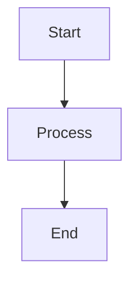
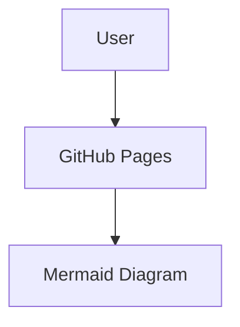
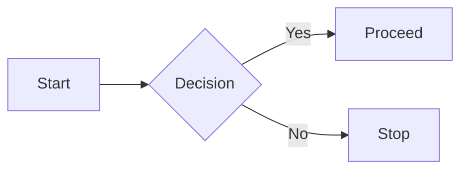
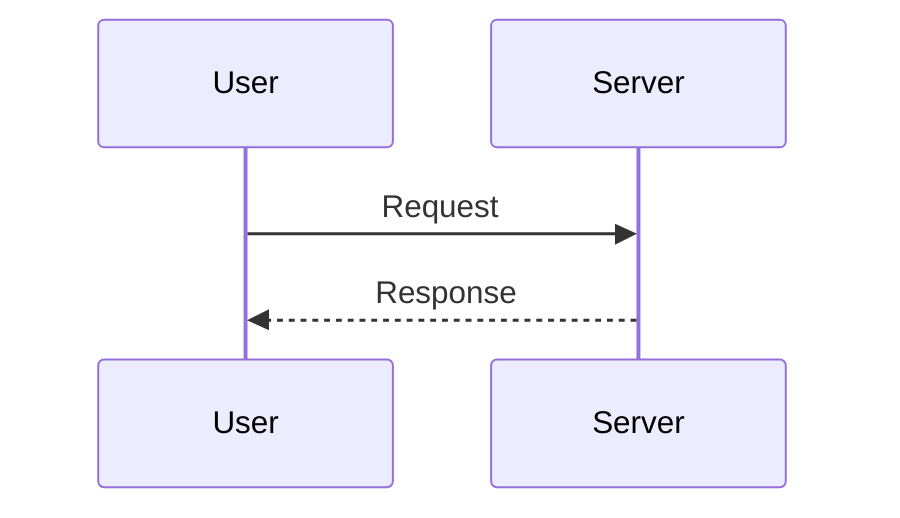

# Mermaid Diagrams in GitHub Pages — User Guide

## Overview

This guide explains how to use Mermaid diagrams in your GitHub Pages portfolio, including installation, configuration, and best practices.

---

## What is Mermaid?

Mermaid is a JavaScript-based tool that lets you create diagrams using simple text syntax.

Example:



It automatically renders into a diagram.

---

## Prerequisites

* GitHub repository
* GitHub Pages enabled
* Basic Markdown knowledge

---

## Installing Dependencies

### Option 1: Using CDN (Recommended)

No installation required. Add this script to your HTML layout:

```html
<script src="https://cdn.jsdelivr.net/npm/mermaid@10/dist/mermaid.min.js"></script>
<script>
  mermaid.initialize({ startOnLoad: true });
</script>
```

---

### Option 2: Using NPM

```bash
npm install mermaid
```

Then import:

```javascript
import mermaid from 'mermaid';
mermaid.initialize({ startOnLoad: true });
```

---

## Installing Mermaid in GitHub Pages

1. Go to repository **Settings → Pages**
2. Select branch (e.g., `main`)
3. Add Mermaid script to your layout file:

```html
<script src="https://cdn.jsdelivr.net/npm/mermaid@10/dist/mermaid.min.js"></script>
<script>
  mermaid.initialize({ startOnLoad: true });
</script>
```

---

## Configuration

```html
<script>
  mermaid.initialize({
    startOnLoad: true,
    theme: 'default',
    flowchart: {
      curve: 'basis'
    }
  });
</script>
```

---

## Creating Your First Diagram

Add this in a `.md` file:

````markdown

````

---

## Example Diagrams

### Flowchart



### Sequence Diagram



---

## Best Practices

* Keep diagrams simple
* Use clear labels
* Maintain consistent themes
* Break large diagrams into smaller ones
* Test before publishing

---

## Common Issues

| Issue             | Fix                      |
| ----------------- | ------------------------ |
| Not rendering     | Ensure script is added   |
| Syntax error      | Validate Mermaid code    |
| Page not updating | Check GitHub Pages build |

---

## FAQ

**1. Does GitHub support Mermaid?**
Yes, but GitHub Pages may require manual setup.

**2. Can I export diagrams?**
Yes, using Mermaid CLI:

```bash
npm install -g @mermaid-js/mermaid-cli
mmdc -i input.mmd -o output.png
```

**3. Available themes?**
default, dark, forest, neutral

---

## Conclusion

Mermaid helps you create clean, maintainable diagrams directly from text, making your portfolio more professional and easier to understand.

---

## Resources

* https://mermaid.js.org
* https://pages.github.com
