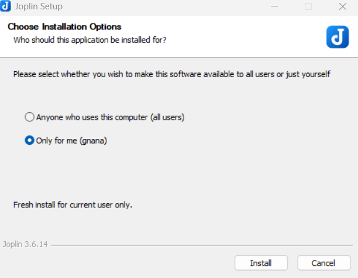
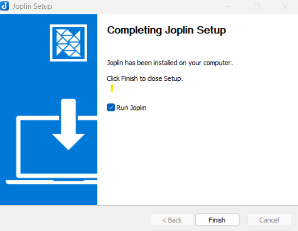
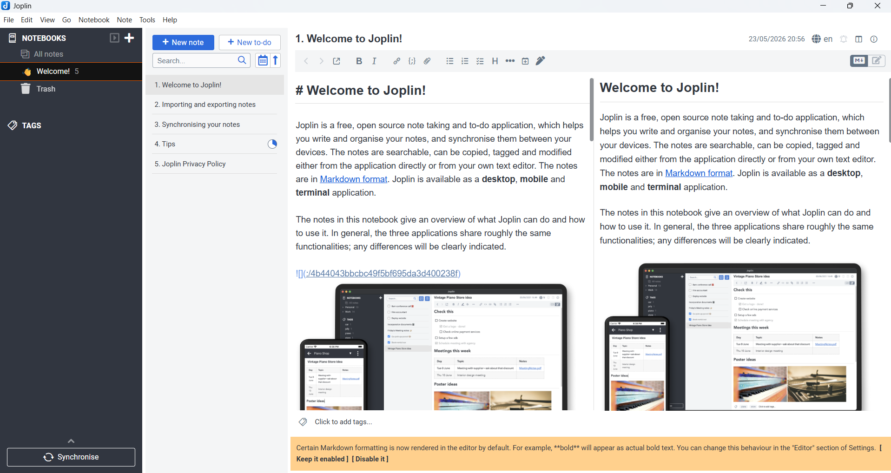
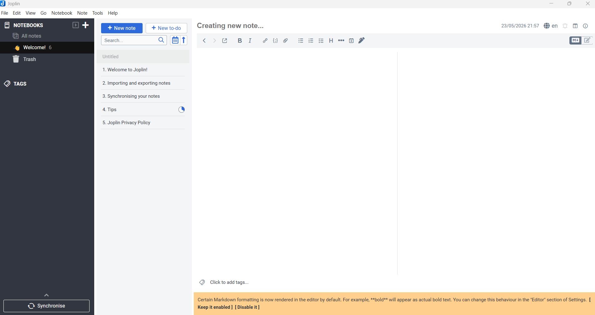
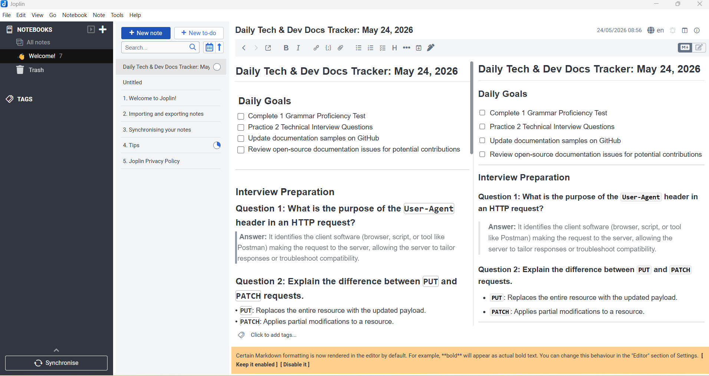
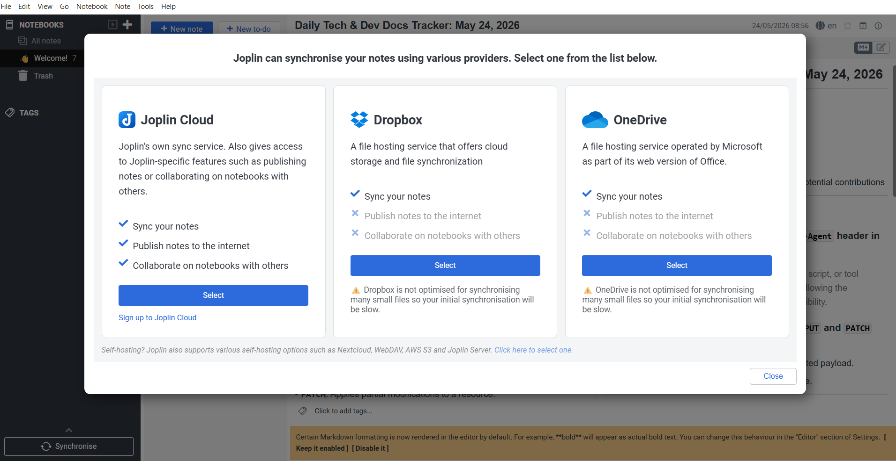
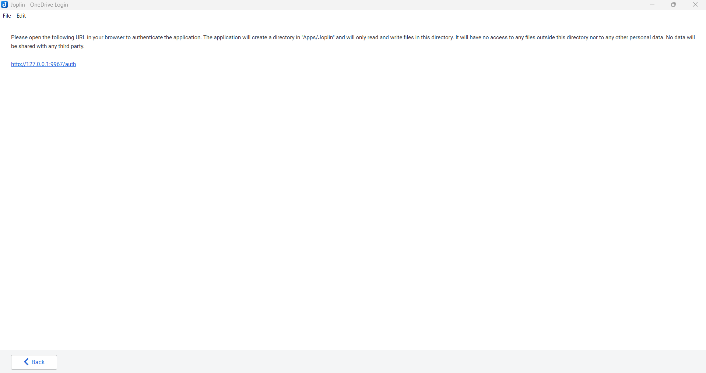
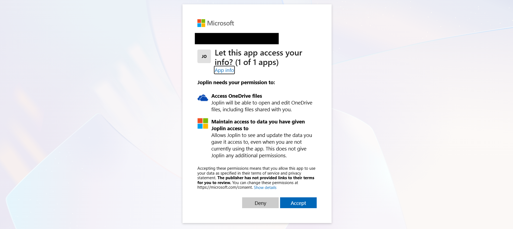
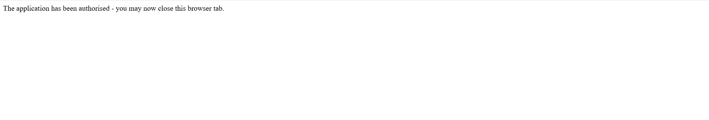
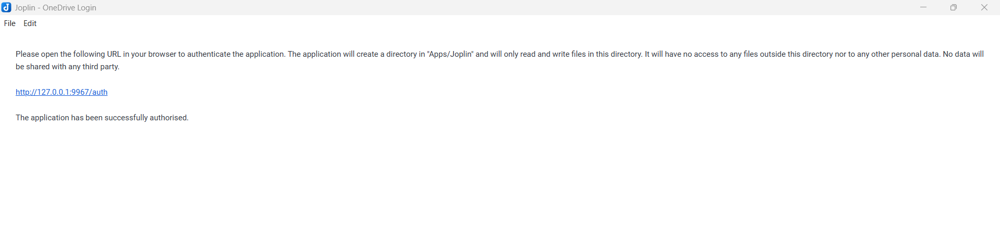

# Joplin User Guide

## Introduction

Joplin is an open source note-taking and personal knowledge management application. This guide covers the most important workflows for using Joplin on desktop, mobile, and web, including note creation, organization, syncing, markdown editing, attachments, and search.

### Install Joplin

- Visit https://joplinapp.org and download the version for Windows.
- Alternatively, install from the command line for desktop builds or use the portable app when available.
- For open source development, the repository is available at https://github.com/joplinapp/joplin.

#### Windows installation 

- When installing on Windows, you will be prompted to choose whether the app is available for all users or only your account as shown below.
- Users can select Anyone who uses computer (All Users) or only for me (Admin name)



- After choosing the install Users, click **Install**.
- When installation completes, click **Finish** button, also Users can enable the Run Joplin option to launch the app after clicking on the **Finish** button.




### Welcome screen (Dashboard)

- When Joplin opens for the first time, you will see a welcome screen with options to import notes or configure sync.
- Select **Get Started** or continue with the default setup to open the main app window.
- **Get Started**: Opens the main Joplin workspace so you can begin creating notes immediately.
- **Import**: Allows you to import notes from other services or backup files if you already have existing Joplin data.
- **Configure Sync**: Opens the synchronization settings so you can connect Dropbox, OneDrive, WebDAV, Nextcloud, or local file sync before using the app.
- **Learn More**: Displays help links and documentation resources for using Joplin.



### Create your first note

1. Open Joplin.
2. In the left sidebar, click the **New note** icon.


5. Enter the notes. The preview of the notes will be displayed in the right side.



> Tip: Use notebooks to separate major contexts like projects, study, and personal notes.

## Editing with Markdown

### Markdown basics

Joplin uses Markdown for formatting notes. Common syntax includes:

- `# Heading 1` for headings
- `**bold**` and `*italic*` for text styles
- `-` or `*` for lists
- `` `inline code` `` for code snippets
- `> blockquote` for quoted text

### Adding checklists

- Create a checklist item using `- [ ] Task name`.
- Mark it complete with `- [x] Task name`.
- Checklists are great for task lists, meeting agendas, or action items.

### Code blocks and attachments

- Use triple backticks for code blocks:

  ```
  ```python
  print("Hello, Joplin")
  ```
  ```

- Add attachments with **Insert > Attach file** or drag files directly into a note.
- Attachments can include images, PDFs, and documents.


### Save & Sync

- Click **Save** or use **Ctrl+S** to save the current note.

The following screen shows the sync options available in Joplin:

- **Joplin Cloud**: the native, fully integrated sync service optimized for notes and Joplin-specific features. Click ([here](https://joplinapp.org/plans/)) to learn more about Joplin Cloud.
- **Dropbox**: a general cloud storage provider that syncs your Joplin note files across devices.
- **OneDrive**: Microsoft’s cloud storage service, also used to sync Joplin note files between devices.



- Select the preferred colud storage option 

Note: the same cloud has to be selected in other devices to Sync with windows.

### Syncing via OneDrive

1. Choose **OneDrive** as your sync target in Joplin.
2. Sign in with your Microsoft account when prompted.
3. Allow Joplin to connect to OneDrive and grant the required access.
4. Wait for the confirmation that syncing is complete.







5. The following success text will be displayed.



## Notes and Organization

### Create a new note

- Click the **New note** button.
- Give the note a title and start typing in the editor.
- Notes are saved automatically as you type.

### Organize with notebooks

- Drag notes into notebooks from the sidebar.
- Use nested notebooks to group related topics (for example, `Projects > FriedNotes`).
- Rename or delete notebooks by right-clicking them.

### Use tags for quick filtering

- Add tags from the note sidebar by typing a tag name and pressing Enter.
- Example tags: `meeting`, `reference`, `todo`, `recipe`.
- Click a tag in the sidebar to see all notes that use it.


## Syncing Notes

### Configure sync

1. Open **Tools > Options > Synchronization**.
2. Choose your sync target: **Dropbox**, **OneDrive**, **Nextcloud**, **WebDAV**, or **File system**.
3. Enter your account or server details.
4. Click **Synchronize** to start.

### Sync workflow

- Sync regularly to keep desktop and mobile notes aligned.
- Joplin stores note revisions, so accidental changes can be recovered.
- If you use multiple devices, sync after finishing work on one device before switching.

## Search and Find

### Search notes

- Use the search field at the top of the notes list.
- Search supports keywords, tags, titles, and full note contents.
- Use `tag:work` or `notebook:Projects` filters for more precise results.

### Advanced search

- Search operators include `tag:`, `notebook:`, `type:`, and `created:`.
- Example: `tag:meeting notebook:Work`.
- This helps when you are tracking notes across many notebooks.

## Import and Export

### Import notes

- Go to **File > Import**.
- Supported formats include JEX, Markdown, Evernote ENEX, and plain text.
- Use import when moving notes from another app or restoring backups.

### Export notes

- Select a note or notebook and choose **File > Export**.
- Export formats include `Markdown`, `PDF`, `HTML`, and `JEX`.
- Export useful notes for sharing or storing as a backup.

## Mobile Usage

### Install and sync mobile

- Install Joplin Mobile from Google Play or the Apple App Store.
- Open the app and choose **Configuration > Synchronization target**.
- Use the same sync target as desktop for seamless note access.

### Mobile features

- Capture quick notes with the mobile editor.
- Use the camera to attach images directly to notes.
- Swipe gestures help move notes, archive, or delete quickly.

## Tips for Productivity

- Use a consistent notebook and tag structure.
- Create templates for recurring note types such as meeting notes, daily journals, or project plans.
- Pin important notes to keep them easy to access.
- Use the map view or note links for personal knowledge management.

## Frequently Asked Questions

Q: Can I use Joplin offline?

A: Yes. Joplin works offline and syncs changes when a network connection is available.

Q: How do I backup my notes?

A: Export your notes to `JEX` or Markdown, or sync to a reliable cloud service.

Q: Is Joplin truly open source?

A: Yes. Joplin is licensed under GPLv3 and its source code is available on GitHub.

Q: Can I encrypt my notes?

A: Yes. Enable **Encryption Options** under **Tools > Options > Encryption** to secure notes and attachments.


